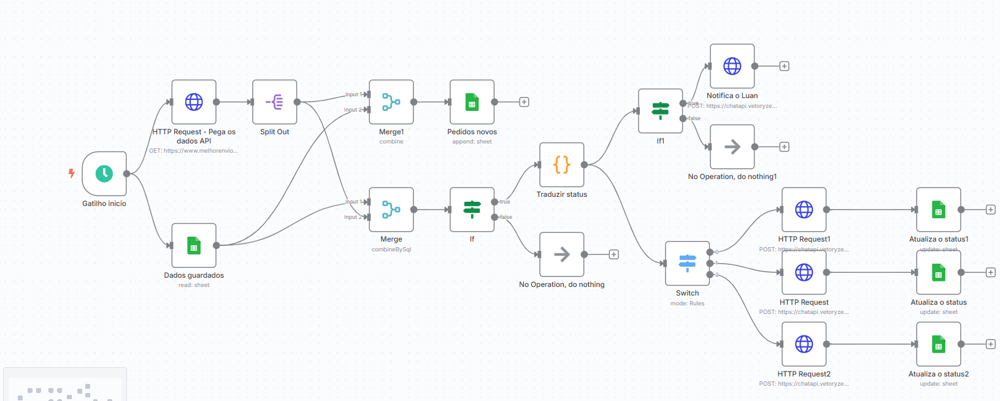

# 🚀 Automação n8n – Envio de mensagem quando muda o status de entrega do destinatário

Este projeto utiliza o [n8n](https://n8n.io/) para automatizar o envio de mensagem para os clientes quando o status de seu pedido mudar no melhor envio.

## 📌 Tecnologias utilizadas
- n8n (plataforma low-code)
- Google Sheets API
- Vetorize API
- HTTP Request

## 🔁 O que essa automação faz?
1. Pega os dados novos da melhor envio via API e compara com dados antigos que estão no google sheets.
2. Grava os dados recebidos no Google Sheets.
3. Envia uma mensagem para o destinario de novo status de pedido.

## 📸 Fluxo no n8n

## 🧠 Autor
**Elenilson Silva**  
[LinkedIn](https://www.linkedin.com/in/elenilson-silva-978a321b8/)  

